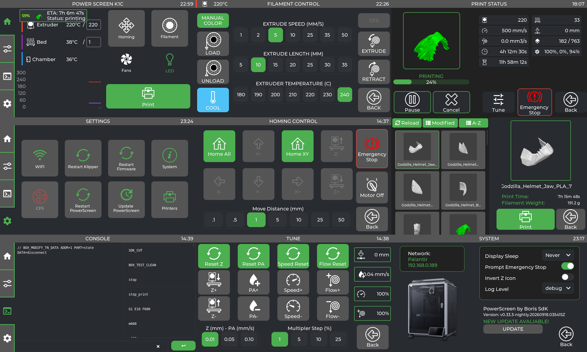

<!--
METADATOS DEL DOCUMENTO
Nombre: `README.md`
Fecha de creación: `2026-09-10`
Descripción: Presentación pública, alcance e instrucciones de PowerScreen para la Creality K1C.
Proyecto: `PowerScreen`
Última modificación: `2026-09-12`
-->

[English](#english) | [Español](#espanol)

---

<a name="english"></a>

# K1C CFS POWER SCREEN

This is a personal modification of PowerScreen focused exclusively on the Creality K1C. It keeps the touch interface base for Klipper/Moonraker and adds features specific to the CFS workflow and manual filament changes.

## Scope

This repository is intended only for:

- Creality K1C.
- The original K1C screen.
- MIPS builds compatible with K1C hardware.
- Custom CFS macros and scripts.

There are no builds, instructions, or support for Android, Raspberry Pi, `PowerScreenDroid`, or other printer models.

## Screenshots



## Installation / Update on a K1C

PowerScreen is installed or updated from an SSH shell on the printer while logged in as `root`. This is the same interactive installation flow used by the original project. Do not install while printing, heating, homing, or running a calibration.

### Requirements

- A Creality K1C with SSH access enabled and reachable on the local network.
- Internet access from the printer to GitHub.
- Moonraker running on the printer.
- The root password of the printer.

The only supported package is `powerscreen-zbolt.tar.gz`, the MIPS Z-Bolt package for the K1C.

### 1. Connect to the printer

Connect to the printer through SSH as `root`:

```sh
ssh -p 22 root@IP_DE_TU_K1C
```

All remaining commands in this section must be executed inside the printer shell.

Verify the platform and available space:

```sh
uname -m
df -h /usr/data
```

The K1C must report `mips`.

### 2. Install or update PowerScreen

Clone this repository directly on the printer and enter the cloned directory:

```sh
cd /usr/data
git clone --recursive https://github.com/borferkic/K1C-CFS-POWER-SCREEN.git PowerScreen
cd /usr/data/PowerScreen
```

Execute the installer from the cloned repository:

```sh
sh ./installer.sh
```

For a later update, enter the existing clone, update its submodules, and run the installer again:

```sh
cd /usr/data/PowerScreen
git pull --recurse-submodules
sh ./installer.sh
```

The installer is configured exclusively for the K1C Z-Bolt package. It downloads the latest `powerscreen-zbolt.tar.gz` from this repository's GitHub Releases, extracts it under `/usr/data/powerscreen`, configures the service and helper files, and starts PowerScreen.

The installer also registers PowerScreen in Moonraker's Update Manager so it appears in Fluidd under the available software services. The registered repository is `borferkic/K1C-CFS-POWER-SCREEN`.

The installer may ask whether to continue when Moonraker is not connected, whether to disable Creality services, and whether to restart Klipper. Read each prompt before answering. Answer `n` to preserve Creality Cloud and Creality Slicer services.

### 3. Validate the installation

Run these checks on the printer:

```sh
test -x /usr/data/powerscreen/powerscreen
test -x /etc/init.d/S99powerscreen
/etc/init.d/S99powerscreen restart
sleep 2
ps | grep '[p]owerscreen'
tail -n 40 /usr/data/printer_data/logs/powerscreen.log
curl -s localhost:7125/server/info | jq .result.klippy_connected
grep -R "PowerScreen" /usr/data/printer_data/config/printer.cfg /usr/data/printer_data/config/PowerScreen 2>/dev/null
```

The process must remain active, the log must not show an immediate crash, and Moonraker must report `true` for `klippy_connected`. On the touchscreen, check the main tabs, open the extrusion panel, open the manual M600 dialog, and verify `LOAD`, `UNLOAD`, `RESUME`, `STOP`, and `CLOSE` individually. Test filament movement only with the correct temperature and a controlled filament path.

## Inherited features

- Console and macro shell.
- Bed Mesh.
- Input Shaper.
- Print status.
- Spoolman integration.
- Extrusion and retraction.
- Temperature control.
- Fan, LED, and movement control.
- Fine tuning for speed, flow, Z-offset, and Pressure Advance.
- Velocity and acceleration limits.
- File browser.
- TMC metrics.

## Additional features in this modification

- `MANUAL M600` button in the extrusion panel.
- Manual filament change dialog adapted to the K1C screen.
- `SDK_UNLOAD_FILAMENT` and `SDK_LOAD_FILAMENT` actions.
- Green `RESUME` action.
- Red `STOP` action using `CANCEL_PRINT`.
- `CLOSE` action to close the dialog.
- Icons for load, unload, resume, and stop actions.
- Button layout reorganized for comfortable touchscreen use on the K1C.

## Development and build

Initialize the submodules when cloning the repository:

```bash
git clone --recursive https://github.com/borferkic/K1C-CFS-POWER-SCREEN.git PowerScreen
cd PowerScreen
```

Building for the K1C uses the MIPS toolchain and workflow maintained in private project documentation. The main configuration uses the `mipsel-buildroot-linux-musl-` compiler and generates:

```text
build/bin/powerscreen
```

Interface and CFS workflow testing must be performed on a real K1C. A successful build does not replace validation of the dialog, macros, or the extruder's physical behavior.

## Pending work

Internal change logs, pending work and release history are kept in private project documentation outside the public repository.

## Support the project

If this project is useful to you, you can support its development through [PayPal](https://paypal.me/borissdk).

## Credits and thanks

This repository is maintained as K1C CFS POWER SCREEN and contains project-specific modifications for the Creality K1C.

The projects and resources used by the original foundation are also acknowledged:

- [LVGL](https://github.com/lvgl/lvgl)
- [Z-Bolt Icons](https://github.com/Z-Bolt/OctoScreen)
- [k1-discovery](https://github.com/ballaswag/k1-discovery) — MIPS toolchain and compatible `curl` helper used by the K1C workflow; thanks to `ballaswag`.
- [Moonraker](https://github.com/Arksine/moonraker)
- [KlipperScreen](https://github.com/KlipperScreen/KlipperScreen)
- [Fluidd](https://github.com/fluidd-core/fluidd)
- [Klippain Shake&Tune](https://github.com/Frix-x/klippain-shaketune)

## License

See [LICENSE](LICENSE) for the terms applicable to the original foundation and this modification.

---

<a name="espanol"></a>

# K1C CFS POWER SCREEN

Esta es una modificación personal de PowerScreen orientada exclusivamente a la Creality K1C. Mantiene la base de la interfaz táctil para Klipper/Moonraker y añade características específicas para el flujo CFS y el cambio manual de filamento.

## Alcance

Este repositorio está destinado únicamente a:

- Creality K1C.
- Pantalla original de la K1C.
- Compilación MIPS compatible con el hardware de la K1C.
- Macros y scripts personalizados para CFS.

No se incluyen builds, instrucciones ni soporte para Android, Raspberry Pi, `PowerScreenDroid` u otros modelos de impresora.

## Capturas de pantalla


## Instalación / actualización en una K1C

PowerScreen se instala o actualiza desde una consola SSH de la impresora iniciada como `root`. Este es el mismo flujo interactivo de instalación utilizado por el proyecto original. No instales mientras la impresora esté imprimiendo, calentando, haciendo homing o ejecutando una calibración.

### Requisitos

- Una Creality K1C con SSH habilitado y accesible desde la red local.
- Acceso a Internet desde la impresora hacia GitHub.
- Moonraker ejecutándose en la impresora.
- La contraseña root de la impresora.

El único paquete compatible es `powerscreen-zbolt.tar.gz`, el paquete MIPS Z-Bolt para la K1C.

### 1. Conectarse a la impresora

Conéctate a la impresora mediante SSH como `root`:

```sh
ssh -p 22 root@IP_DE_TU_K1C
```

Todos los comandos restantes de esta sección deben ejecutarse dentro de la consola de la impresora.

Verifica la plataforma y el espacio disponible:

```sh
uname -m
df -h /usr/data
```

La K1C debe responder `mips`.

### 2. Instalar o actualizar PowerScreen

Clona este repositorio directamente en la impresora y entra en la carpeta clonada:

```sh
cd /usr/data
git clone --recursive https://github.com/borferkic/K1C-CFS-POWER-SCREEN.git PowerScreen
cd /usr/data/PowerScreen
```

Ejecuta el instalador desde el repositorio clonado:

```sh
sh ./installer.sh
```

Para una actualización posterior, entra en la copia existente, actualiza sus submódulos y vuelve a ejecutar el instalador:

```sh
cd /usr/data/PowerScreen
git pull --recurse-submodules
sh ./installer.sh
```

El instalador está configurado exclusivamente para el paquete K1C Z-Bolt. Descarga el último `powerscreen-zbolt.tar.gz` desde las GitHub Releases de este repositorio, lo extrae en `/usr/data/powerscreen`, configura el servicio y los archivos auxiliares, y arranca PowerScreen.

El instalador también registra PowerScreen en el Update Manager de Moonraker para que aparezca en Fluidd entre los servicios de software disponibles. El repositorio registrado es `borferkic/K1C-CFS-POWER-SCREEN`.

El instalador puede preguntar si debe continuar cuando Moonraker no está conectado, si debe deshabilitar servicios de Creality y si debe reiniciar Klipper. Lee cada pregunta antes de responder. Responde `n` si deseas conservar Creality Cloud y Creality Slicer.

### 3. Validar la instalación

Ejecuta estas comprobaciones en la impresora:

```sh
test -x /usr/data/powerscreen/powerscreen
test -x /etc/init.d/S99powerscreen
/etc/init.d/S99powerscreen restart
sleep 2
ps | grep '[p]owerscreen'
tail -n 40 /usr/data/printer_data/logs/powerscreen.log
curl -s localhost:7125/server/info | jq .result.klippy_connected
grep -R "PowerScreen" /usr/data/printer_data/config/printer.cfg /usr/data/printer_data/config/PowerScreen 2>/dev/null
```

El proceso debe mantenerse activo, el log no debe mostrar un cierre inmediato y Moonraker debe responder `true` en `klippy_connected`. En la pantalla táctil revisa las pestañas principales, abre el panel de extrusión, abre el diálogo M600 manual y verifica individualmente `LOAD`, `UNLOAD`, `RESUME`, `STOP` y `CLOSE`. Prueba el movimiento de filamento únicamente con la temperatura correcta y el recorrido preparado.

## Características heredadas

- Consola y shell de macros.
- Bed Mesh.
- Input Shaper.
- Estado de impresión.
- Integración con Spoolman.
- Extrusión y retracción.
- Control de temperaturas.
- Control de ventiladores, LED y movimiento.
- Ajuste fino de velocidad, flujo, Z-offset y Pressure Advance.
- Límites de velocidad y aceleración.
- Explorador de archivos.
- Métricas TMC.

## Características adicionales de esta modificación

- Botón `MANUAL M600` en el panel de extrusión.
- Diálogo de cambio manual de filamento adaptado a la pantalla de la K1C.
- Acciones `SDK_UNLOAD_FILAMENT` y `SDK_LOAD_FILAMENT`.
- Acción `RESUME` en color verde.
- Acción `STOP` en color rojo mediante `CANCEL_PRINT`.
- Acción `CLOSE` para cerrar el diálogo.
- Iconos para las acciones de carga, descarga, reanudación y detención.
- Botones reorganizados para facilitar el uso táctil en la K1C.

## Desarrollo y compilación

Los submódulos deben inicializarse al clonar el repositorio:

```bash
git clone --recursive https://github.com/borferkic/K1C-CFS-POWER-SCREEN.git PowerScreen
cd PowerScreen
```

La compilación para la K1C utiliza el toolchain MIPS y el flujo de trabajo conservados en la documentación privada del proyecto. La configuración principal usa el compilador `mipsel-buildroot-linux-musl-` y genera:

```text
build/bin/powerscreen
```

Las pruebas de interfaz y del flujo CFS deben realizarse en una K1C real. Una compilación correcta no sustituye la validación del diálogo, las macros ni el comportamiento físico del extrusor.

## Pendientes

Los registros internos de cambios, pendientes e historial de versiones se conservan en documentación privada fuera del repositorio público.

## Apoyo al proyecto

Si este proyecto te resulta útil, puedes apoyar su desarrollo mediante [PayPal](https://paypal.me/borissdk).

## Créditos y agradecimientos

Este repositorio se mantiene como K1C CFS POWER SCREEN e incluye modificaciones específicas para la Creality K1C.

También se reconocen los proyectos y recursos utilizados por la base original:

- [LVGL](https://github.com/lvgl/lvgl)
- [Z-Bolt Icons](https://github.com/Z-Bolt/OctoScreen)
- [k1-discovery](https://github.com/ballaswag/k1-discovery) — toolchain MIPS y helper `curl` compatible usados por el flujo de la K1C; agradecimiento a `ballaswag`.
- [Moonraker](https://github.com/Arksine/moonraker)
- [KlipperScreen](https://github.com/KlipperScreen/KlipperScreen)
- [Fluidd](https://github.com/fluidd-core/fluidd)
- [Klippain Shake&Tune](https://github.com/Frix-x/klippain-shaketune)

## Licencia

Consulta [LICENSE](LICENSE) para conocer los términos aplicables a la base original y a esta modificación.
